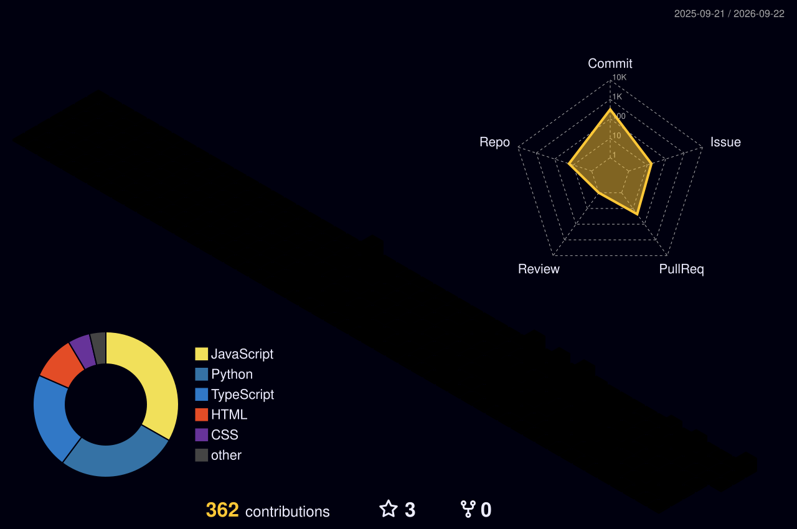

### `WHO I AM`

Hey, I'm Jonathan — a Sydney-based engineer finishing my Honours in Software Engineering at UTS (graduating Dec 2026, WAM 74.57). I lead cross-disciplinary teams by day, chase F1 telemetry data by night, and firmly believe AI won't replace engineers — it'll just make the good ones faster.

### `WHAT I DO`

Right now I supervise 11 internship teams and mentor 69 junior engineers at **Optik Consultancy**, where I also led delivery of a hospital tech prototype for the Woolcock Institute (Arduino sensors talking to a React/Electron app, no pressure). Outside of that I build things because I can't help it — an AI requirements agent for my thesis, a real-time respiratory monitoring system for Royal North Shore Hospital, and a wellbeing dashboard that uses the Yerkes-Dodson curve to tell program managers when a cohort is about to burn out.

### `VISION`

I want to work where AI and software engineering actually meet — not chasing hype, but building tools that make engineers sharper and give them back time for the problems that matter. Technical depth + real-world impact, ideally in the same sprint.

### `BEYOND CODE`

Weightlifting, motorsports (I once processed 673,000 GPS points just to relive the 2024 Monaco GP at true race pace — no regrets), volleyball, video games, and whatever instrument is closest.

### `CONNECT`

### `LIVE STATS`

### `CONTRIBUTION GRID`

<!--START_3D_CONTRIB-->

<!--END_3D_CONTRIB-->

### `SKILL SET`

### `FEATURED BUILDS`

<table>
<tr>
<td width="50%" valign="top">

**🏎️ F1 Race Replay Dashboard**
Real-time replay of the 2024 Monaco GP — 673K+ GPS telemetry points, cubic spline interpolation, all 20 drivers rendered at true race pace.
`Python` `Dash` `FastF1` `OpenF1`

</td>
<td width="50%" valign="top">

**🧠 CLARA**
Conversational AI agent for requirements elicitation — my Honours thesis. Multi-turn dialogue that turns messy stakeholder input into structured requirements.
`Python` `AI` `NLP`

</td>
</tr>
<tr>
<td width="50%" valign="top">

**💓 Pulse**
Team wellbeing dashboard built on the Yerkes-Dodson curve. Anonymous weekly check-ins → live signal on whether a cohort is thriving or burning out.
`Next.js` `Supabase` `PostgreSQL` `Recharts`

</td>
<td width="50%" valign="top">

**🏥 RDS — Respiratory Dynamics Software**
Real-time respiratory monitoring system for clinical research at Royal North Shore Hospital, delivered in a fixed 12-week window.
`Arduino` `Signal Processing` `React`

</td>
</tr>
<tr>
<td width="50%" valign="top">

**⛪ YA34**
Hub app unifying Planning Center + Genesis for connect group leaders — shared calendar, CG planning, lunch rostering.
`Next.js` `NestJS` `MySQL` `Drizzle ORM`

</td>
<td width="50%" valign="top">

**🎙️ SAGE**
Voice-enabled study assistant for engineering learners — Gemini for conversation, edge-tts for spoken answers.
`Streamlit` `Gemini` `edge-tts`

</td>
</tr>
</table>

**contribution snake** 🐍

<!--START_SNAKE-->

<!--END_SNAKE-->

